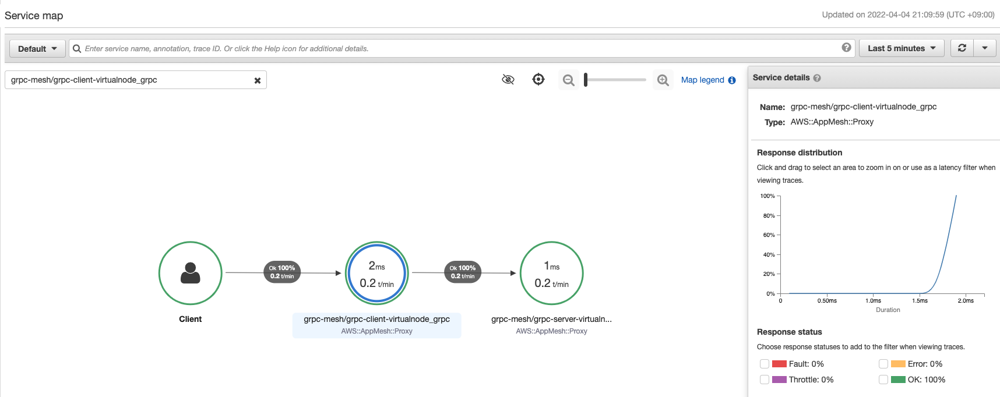

## What is this application?

This application provides the time based on timezone with gRPC.

## Deploy all resources

1. Create EKS cluster

Ex.
```
$ eksctl create cluster --with-oidc --vpc-nat-mode=Disable
```

2. Deploy App Mesh CRD & Controller <br>
https://github.com/aws/eks-charts/tree/master/stable/appmesh-controller
   
You should set `tracing.enabled` and `tracing.provider` options if you want to use X-Ray. <br>
Ex.
```
helm upgrade -i appmesh-controller eks/appmesh-controller \
    --namespace appmesh-system \
    --set region=$AWS_REGION \
    --set serviceAccount.create=false \
    --set serviceAccount.name=appmesh-controller \
    --set tracing.enabled=true \
    --set tracing.provider=x-ray    
```

3. Deploy gRPC client/server as Pod

```
$ git clone https://github.com/a2ush/sample-grpc-server-with-appmesh-xray.git
$ cd sample-grpc-server-with-appmesh-xray

$ kubectl apply -f manifests/WithoutECRImage/
```

4. Deploy CR related to App Mesh
```
$ kubectl apply -f appmesh/
```

5. Inject envoy & x-ray daemon container 
```
$ kubectl rollout restart deploy -n grpc
```

6. Test

gRPC
```
$ kubectl run grpc-cli --image=<Container image with grpc_cli> -n grpc --annotations="appmesh.k8s.aws/sidecarInjectorWebhook=disabled"
pod/grpc-cli created
$ kubectl exec -it grpc-cli -n grpc -- bash

# grpc_cli ls grpc-server:50051 -l
filename: reflection/grpc_reflection_v1alpha/reflection.proto
package: grpc.reflection.v1alpha;
service ServerReflection {
  rpc ServerReflectionInfo(stream grpc.reflection.v1alpha.ServerReflectionRequest) returns (stream grpc.reflection.v1alpha.ServerReflectionResponse) {}
}

filename: grpc-echo-server.proto
package: rpc;
service TimeManage {
  rpc ConvertTime(rpc.ClientRequest) returns (rpc.ServerResponse) {}
}

# grpc_cli type grpc-server:50051 rpc.ClientRequest
message ClientRequest {
  .rpc.Timezone.Format timezone_format = 1[json_name = "timezoneFormat"];
}
```

Send request to grpc-client
```
$ kubectl -n grpc run test --image=amazonlinux:2 --annotations="appmesh.k8s.aws/sidecarInjectorWebhook=disabled" -- sleep 3600
$ kubectl -n grpc exec -it test -- bash
bash-4.2# 
bash-4.2# curl grpc-client:8080
{"convert_time":"2022-02-17T14:41:17Z"}
bash-4.2# curl grpc-client:8080/jst
{"convert_time":"2022-02-17T23:41:24+09:00"}
```

X-Ray Console

